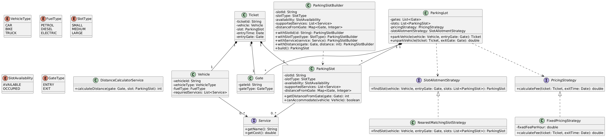

# Parking Lot System - Detailed Usage Guide

## Overview

This is a comprehensive parking lot management system designed using object-oriented principles and design patterns. The system handles vehicle entry, spot allocation, billing, and payment processing with a flexible and extensible architecture.

## Key Features

- **Multi-level parking support** with different spot types
- **Dynamic spot allocation** based on vehicle type and availability
- **Flexible billing system** with configurable pricing strategies
- **Payment processing** with success/failure handling
- **Extensible design** using strategy and facade patterns

## System Components

### 1. Core Entities

- **Vehicle**: Represents different types of vehicles (Car, Motorcycle, Truck, etc.)
- **Spot**: Parking spots with different sizes and availability status
- **Ticket**: Generated when vehicle enters, contains timing and billing information
- **Gate**: Entry and exit points for the parking lot

### 2. Main Services

#### Spot Allocation Service

Handles finding and assigning appropriate parking spots:

```java
SpotAllocationService spotService = new DefaultSpotAllocationService(spotStrategy);
Spot assignedSpot = spotService.allocateSpot(vehicle, parkingLot);
```

#### Billing Service

Processes payments with flexible callback handling:

```java
BillingService billingService = new DefaultBillingService(billingStrategy);

billingService.pay(ticket)
    .onSuccess(() -> {
        System.out.println("Payment successful! Gate opening...");
        // Release the parking spot
        // Update parking records
    })
    .onFailure(() -> {
        System.out.println("Payment failed! Please try again.");
        // Handle payment failure
        // Keep spot occupied
    })
    .execute();
```

### 3. Strategies

#### Billing Strategy

Configure different pricing models:

```java
// Default hourly billing at $10/hour with $5 minimum
BillingStrategy billingStrategy = new DefaultBillingStrategy();

// Custom billing strategy can be implemented
public class PremiumBillingStrategy implements BillingStrategy {
    @Override
    public PaymentStatus calculate(Ticket ticket) {
        // Custom pricing logic
        // VIP rates, weekend rates, etc.
    }
}
```

#### Spot Allocation Strategy

Control how spots are assigned:

```java
// Default strategy - finds nearest available spot
SpotAllocationStrategy spotStrategy = new DefaultSpotAllocationStrategy(distanceRepo);

// Custom allocation strategy
public class VIPSpotAllocationStrategy implements SpotAllocationStrategy {
    @Override
    public Spot allocateSpot(Vehicle vehicle, ParkingLot parkingLot) {
        // Prioritize premium spots for VIP vehicles
    }
}
```

## Usage Examples

### Complete Parking Flow

```java
public class ParkingLotExample {
    public static void main(String[] args) {
        // 1. Initialize the system
        ParkingLot parkingLot = new ParkingLot();
        DistanceRepository distanceRepo = new SimpleDistanceRepository();

        // 2. Setup services with strategies
        SpotAllocationStrategy spotStrategy = new DefaultSpotAllocationStrategy(distanceRepo);
        SpotAllocationService spotService = new DefaultSpotAllocationService(spotStrategy);

        BillingStrategy billingStrategy = new DefaultBillingStrategy();
        BillingService billingService = new DefaultBillingService(billingStrategy);

        // 3. Setup facade
        ParkingLotFacade facade = new ParkingLotFacade(spotService, billingService);

        // 4. Vehicle entry
        Vehicle car = new Vehicle(VehicleType.CAR, "ABC-123");
        Ticket ticket = facade.enterVehicle(car, parkingLot);

        if (ticket != null) {
            System.out.println("Vehicle parked successfully! Ticket ID: " + ticket.getId());
            System.out.println("Spot assigned: " + ticket.getSpot().getId());
        } else {
            System.out.println("No available spots for this vehicle type.");
            return;
        }

        // 5. Vehicle exit and payment
        ticket.setExitedAt(new Timestamp(System.currentTimeMillis()));

        billingService.pay(ticket)
            .onSuccess(() -> {
                System.out.println("Payment of $" + ticket.getAmount() + " processed successfully!");
                System.out.println("Thank you for parking with us. Have a great day!");
                // Release the spot
                ticket.getSpot().setAvailable(true);
            })
            .onFailure(() -> {
                System.out.println("Payment processing failed. Please contact support.");
                System.out.println("Vehicle cannot exit until payment is completed.");
            })
            .execute();
    }
}
```

### Advanced Usage Scenarios

#### 1. Custom Billing for Different Vehicle Types

```java
public class VehicleTypeBillingStrategy implements BillingStrategy {
    private Map<VehicleType, Double> rateMap;

    public VehicleTypeBillingStrategy() {
        rateMap = new HashMap<>();
        rateMap.put(VehicleType.MOTORCYCLE, 5.0);
        rateMap.put(VehicleType.CAR, 10.0);
        rateMap.put(VehicleType.TRUCK, 20.0);
    }

    @Override
    public PaymentStatus calculate(Ticket ticket) {
        VehicleType vehicleType = ticket.getVehicle().getType();
        double hourlyRate = rateMap.getOrDefault(vehicleType, 10.0);

        // Calculate duration and amount
        Duration duration = Duration.between(
            ticket.getIssuedAt().toInstant(),
            ticket.getExitedAt().toInstant()
        );
        double hours = Math.ceil(duration.toMinutes() / 60.0);
        double amount = Math.max(hours * hourlyRate, hourlyRate * 0.5); // Minimum 30 minutes

        ticket.setAmount(amount);
        return PaymentStatus.COMPLETED;
    }
}
```

#### 2. Priority Spot Allocation

```java
public class PrioritySpotAllocationStrategy implements SpotAllocationStrategy {
    private DistanceRepository distanceRepo;

    @Override
    public Spot allocateSpot(Vehicle vehicle, ParkingLot parkingLot) {
        List<Spot> availableSpots = parkingLot.getAvailableSpots(vehicle.getType());

        if (vehicle.isPriority()) {
            // Allocate closest spots to entrance for priority vehicles
            return availableSpots.stream()
                .min(Comparator.comparing(spot -> distanceRepo.getDistance(spot, parkingLot.getEntrance())))
                .orElse(null);
        } else {
            // Regular allocation logic
            return availableSpots.isEmpty() ? null : availableSpots.get(0);
        }
    }
}
```

## Configuration Options

### Pricing Configuration

- **Hourly Rate**: Configurable per vehicle type
- **Minimum Charge**: Set minimum parking fee
- **Grace Period**: Free parking for initial minutes
- **Maximum Daily Rate**: Cap on daily charges

### Spot Management

- **Spot Types**: Configure different spot sizes
- **Capacity Management**: Set limits per vehicle type
- **Reservation System**: Allow spot pre-booking

### Payment Options

- **Multiple Payment Methods**: Credit card, cash, mobile payments
- **Discount Codes**: Apply promotional discounts
- **Membership Programs**: Special rates for members

## Error Handling

The system includes comprehensive error handling for common scenarios:

- **No Available Spots**: Graceful handling when parking lot is full
- **Payment Failures**: Retry mechanisms and alternative payment options
- **System Errors**: Logging and recovery procedures
- **Invalid Tickets**: Validation and security measures

## Extensibility

The system is designed for easy extension:

- **New Vehicle Types**: Add support for electric vehicles, oversized vehicles
- **Dynamic Pricing**: Implement surge pricing, time-based rates
- **Integration**: Connect with external payment gateways, mobile apps
- **Analytics**: Add reporting and usage analytics
- **Automation**: Integrate with license plate recognition, automated barriers

This parking lot system provides a robust foundation that can be adapted to various real-world parking scenarios while maintaining clean code architecture and extensibility.
